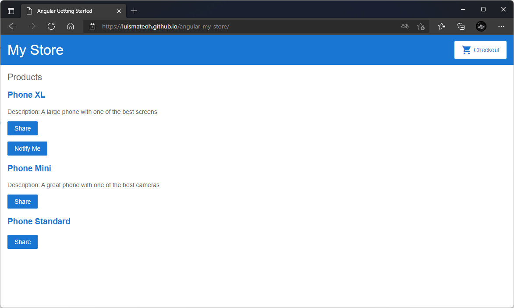

# Angular - My Store Example

[Demo](https://luismateoh.github.io/angular-my-store/)



This is a test project to demostrate the using of gh-pages with Angular.

## Get started

### Clone the repo

```shell
git clone https://github.com/luismateoh/angular-my-store
cd angular-my-store
```


### Install npm packages

Install the `npm` packages described in the `package.json` and verify that it works:

```shell
npm install
npm start
```

The `npm start` command builds (compiles TypeScript and copies assets) the application into `dist/`, watches for changes to the source files, and runs `lite-server` on port `4200`.

Shut it down manually with `Ctrl-C`.

#### npm scripts

These are the most useful commands defined in `package.json`:

* `npm start` - runs the TypeScript compiler, asset copier, and a server at the same time, all three in "watch mode".
* `npm run build` - runs the TypeScript compiler and asset copier once.
* `npm run build:watch` - runs the TypeScript compiler and asset copier in "watch mode"; when changes occur to source files, they will be recompiled or copied into `dist/`.
* `npm run lint` - runs `tslint` on the project files.
* `npm run serve` - runs `lite-server`.

These are the test-related scripts:

* `npm test` - builds the application and runs Intern tests (both unit and functional) one time.
* `npm run ci` - cleans, lints, and builds the application and runs Intern tests (both unit and functional) one time.
